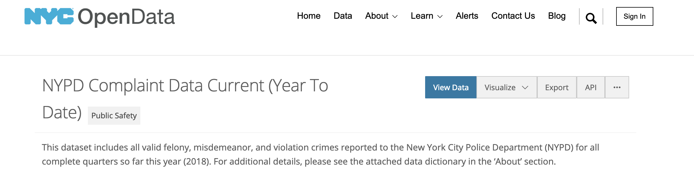
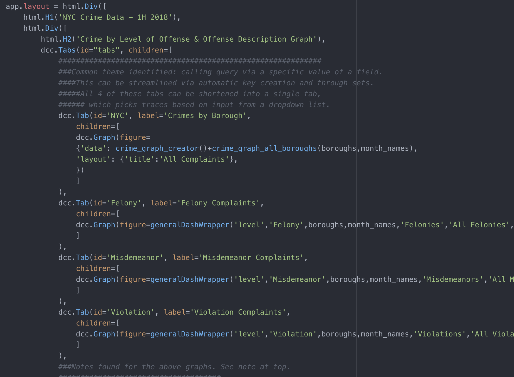
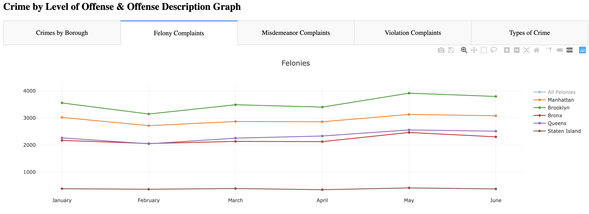

# NYC COMPLAINT VISUALIZATION:  JANUARY - JUNE 2018

Using NYC Open Data, create an app that includes multiple visualizations, including a location-based heatmap, of all valid felony, misdemeanor, and violation crimes reported to the New York City Police Department (NYPD) in the first half of 2018.

## Motivation

The goal of this project is to explore the complaint data provided by NYPD and make meaningful observations using a visually appealing and interesting web app, while creating a relational database that is actively referenced by the app. 

## Background Information

NYC Open Data is the preeminent source for a trove of data sets for New York City. With over 1200 datasets avaialble, it provides information on many of the city's hundreds of departments and allows for anyone willing to delve into a topic of their choosing to understand the city through its vast data resources. 

All of this information is given so that the government and people of New York can better understand a immensely complex society and for others to potentially provide ideas and innovations to improve living in the city.

## Data Extraction and Storage

My first step was choosing which dataset that would provide the complexity and diversity of information for the scale of a project of this nature, yet also being accessible enough for my first attempt at exploring a data science-type project. 

The complaint data provided ~229,000 unique entries spanning the first six months of 2018 and included a variety of data points including a categorized crime description, the latitude and longitude coordinates of the complaint, complaint date, and high-level suspect and victim information.

The data was pulled using the Open Data's API, filtered through a custom-built OOP program, and stored in a SQLite database.

## Visualization Platform

The next step was to utilize the Flask and Dash platforms to create a visually appealing web app to present the data stored within the database. 

### App Initialization

    1) App activation file that can be referenced in terminal to begin initialization. 
    2) Flask initialization:
        -- Configures database to app using SQLAlchemy, which will allow the app to perform SQL queries
        -- Import Dashboard file
    3a) Dashboard Initialization:
        -- Imports all relevant SQL queries from the "dash_queries" file (see below for more)
        -- Import the Dash dependencies in order for relevant Dash classes to operate
        -- Create H1 and H2 header for the app's Line/Bar Chart section
        -- Line/Bar Chart Tabs:
            -- Create five interactive tabs that all a user to review information:
                -- Four line graphs separated by borough over time by:
                    -- All complaints
                    -- Felonies only
                    -- Misdemeanors only
                    -- Violations only
                -- A histogram showing the frequency of crimes by primary description

    3b) Dashboard Initialization:
       -- Interactive Cluster Map:
           -- Create a drop down of that include all primary descriptions within the database
           -- User can search for and select any primary description in the database
           -- Selecting a given description will prompt the app to search for a pre-constructed html file* that will show a heat map of the complaint's location.
           -- User can:
               -- Interact with the map to gain more information about a complaint at a given location
               -- Select a new description from the drop down to bring up a new map
           
*See 'dash_query' file for html file creation

## Next Steps

    1) Clean up repo folder structure, so file folders are easier to follow
    2) Add CSS code to add background color to app
